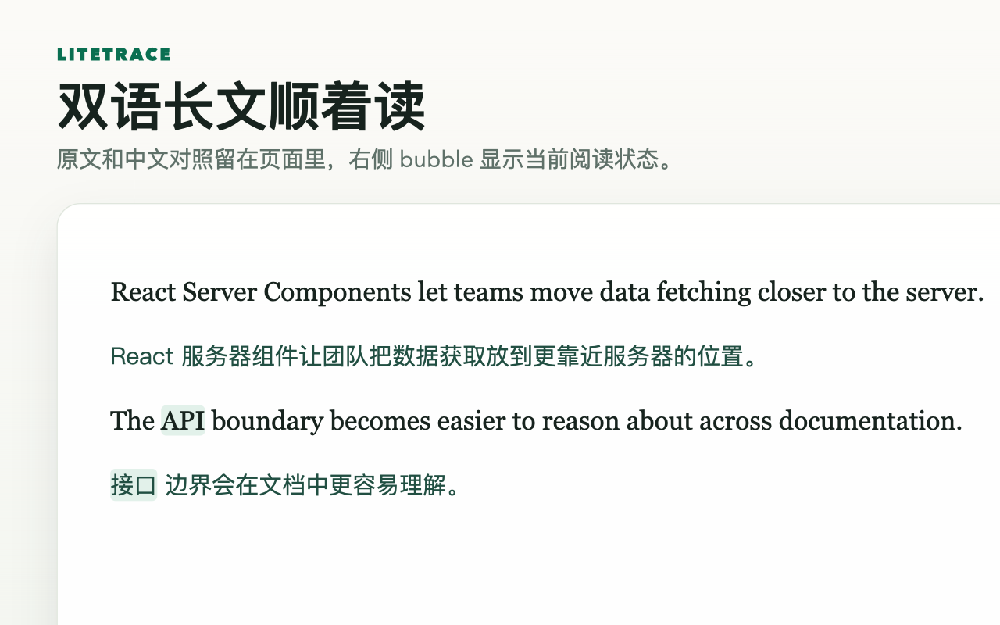

# LiteTrace

LiteTrace（浅译）是一款面向英文技术阅读的 Chrome 双语翻译插件。

它适合用来阅读技术文档、博客、论文摘要、教程和产品说明。你可以接入自己的 OpenAI Compatible / LLM API，在网页里生成中英双语对照；也可以维护一个本地术语库，让 API、框架名、产品概念和专业词汇保持稳定译法。

## 核心功能

- **接入自己的大模型 API**：支持 OpenAI Compatible 接口，自行配置 Base URL、模型和 API Key。
- **本地术语记忆**：选中英文后右键加入术语，后续 LLM 翻译会优先使用命中的术语译法。
- **沉浸式双语阅读**：在网页正文后插入中文译文，保留原文上下文。
- **划词翻译**：选中文本后，通过页面内 icon 快速查看局部翻译。
- **即时修正当前页**：保存新术语后，当前页面里相关的已译段落会自动重译。
- **Google Translate 备选**：不需要 LLM 时，也可以切换到 Google Translate API。

## 为什么做它

读英文技术长文时，难点不只是翻译一句话，而是连续读下来不被打断。

LiteTrace 用双语对照降低阅读成本，再用本地术语库固定关键概念的译法。你也可以接入自己的大模型 API，把翻译质量、费用和数据流向掌握在自己手里。

## 隐私

LiteTrace 不提供自有云端翻译服务，也不会收集或托管你的 API Key。本仓库开源所有代码，方便你检查扩展如何处理本地配置、术语和翻译请求。

用户选中的文本、网页中待翻译的英文内容，以及命中的启用术语，只会发送到你自己配置的翻译提供商。详细说明见 [PRIVACY.md](./PRIVACY.md)。
